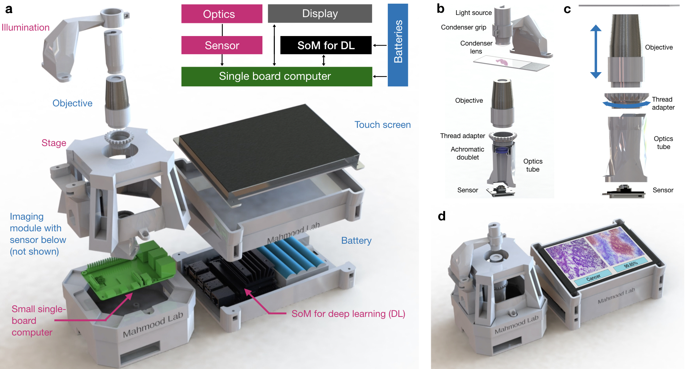

# Embedded Scope

A 3D printed embedded AI-based microscope for pathology diagnosis.

STL files for 3D printing are in `/stls`. The prints have been tested using a stereolithography (SLA) 3D printer. STLs were generated in openscad and scripts can be found in `/stl_gen`.

To build the device, please see [parts list and instructions with images](stls/assembly_instructions.pdf) here. Also see [assembly video]() for a very general overview of assembly. 

